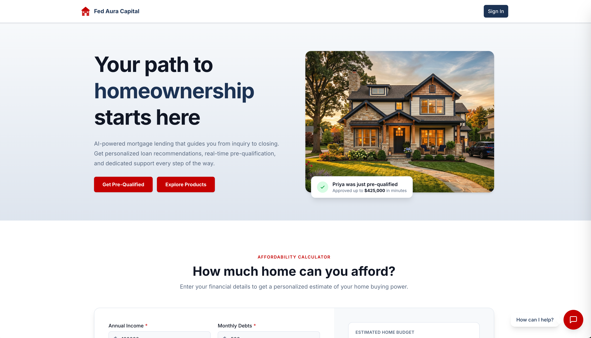

<!-- This project was developed with assistance from AI tools. -->

# Automate mortgage lending with multi-agent AI

Red Hat AI reference application demonstrating agentic AI orchestration across the mortgage lending lifecycle, from prospect inquiry to underwriting approval.

## Table of contents

- [Detailed description](#detailed-description)
  - [See it in action](#see-it-in-action)
  - [Architecture diagrams](#architecture-diagrams)
- [Requirements](#requirements)
  - [Minimum hardware requirements](#minimum-hardware-requirements)
  - [Minimum software requirements](#minimum-software-requirements)
- [Deploy](#deploy)
  - [Delete](#delete)
- [References](#references)
- [Technical details](#technical-details)
  - [Personas](#personas)
  - [Key AI patterns](#key-ai-patterns)
  - [Project structure](#project-structure)
  - [Technology stack](#technology-stack)
  - [Testing](#testing)
  - [Environment configuration](#environment-configuration)
  - [MLflow observability](#mlflow-observability-rhoai-34)
  - [Predictive model integration](#predictive-model-integration-optional)
- [Tags](#tags)

## Detailed description

This Red Hat AI reference application showcases multi-agent AI systems on Red Hat OpenShift AI through a realistic, regulated-industry use case. Built for Red Hat Summit, this application uses a fictional mortgage lender to demonstrate how AI can orchestrate complex, multi-persona workflows in financial services.



The application covers the complete mortgage lending lifecycle with five distinct persona experiences: prospect inquiry, borrower application intake, loan officer pipeline management, underwriter compliance checks and risk assessment, and executive analytics. Each persona interacts with a specialized LangGraph agent backed by role-scoped tools, compliance knowledge retrieval, and comprehensive audit trails.

This quickstart demonstrates AI patterns for regulated industries including role-based access control (RBAC) scoped agent routing, pgvector-based compliance knowledge base with regulatory source tiering, HMDA demographic data isolation, fair lending safeguards, personally identifiable information (PII) masking, vision-based document extraction, and hash-chained audit events. The architecture deploys to OpenShift AI but also runs locally for development and exploration.

> **Regulatory disclaimer:** All compliance content (HMDA, ECOA, TRID, ATR/QM, FCRA) is simulated for demonstration purposes and does not constitute legal or regulatory advice.

### See it in action

[Interactive walkthrough](https://interact.redhat.com/share/UgvwvL982CGksrFdjHT1)

### Architecture diagrams

#### System architecture


#### Agent request flow


## Requirements

### Minimum hardware requirements

**For local development:**

- 16GB RAM minimum (32GB recommended for running all services + LLM locally)
- 20GB available disk space for container images and model files
- Multi-core CPU (4+ cores recommended)

**For OpenShift deployment (tested with OpenShift 4.21):**

- OpenShift cluster with Red Hat OpenShift AI installed
- LLM access via either:
  - Model-as-a-Service (MaaS) endpoint (no GPU required on cluster), or
  - GPU node for on-cluster model serving (sized for your chosen model)
- Persistent volume claims: 10Gi for PostgreSQL, 10Gi for MinIO object storage

### Minimum software requirements

- Node.js 22+ and pnpm 9+ (tested with Node.js 22 LTS, pnpm 9.15)
- Python 3.11+ and [uv](https://docs.astral.sh/uv/) (tested with Python 3.13, uv 0.11)
- Podman 4+ and podman-compose (tested with Podman 4.9)
- PostgreSQL 16 with pgvector (provided via compose for local development)
- An OpenAI-compatible LLM endpoint (local inference server, OpenShift AI model serving, or any compatible API)

## Deploy

### Local development deployment

Clone the repository and install dependencies:

```bash
make setup                # Install all dependencies
cp .env.example .env      # Configure LLM endpoint and model names
```

Edit `.env` to point to your LLM endpoint. For a local inference server:

```env
LLM_BASE_URL=http://localhost:1234/v1
LLM_API_KEY=not-needed
LLM_MODEL=qwen3-30b-a3b
```

Start the development environment:

```bash
make db-start             # Start PostgreSQL and MinIO
make db-upgrade           # Run database migrations
make dev                  # Start API and UI dev servers
```

The application will be available at the following URLs:

| Service | URL |
|---------|-----|
| Frontend (Vite) | http://localhost:3000 |
| API Server | http://localhost:8000 |
| API Docs (Swagger) | http://localhost:8000/docs |
| Database | postgresql://localhost:5433 |
| MinIO Console | http://localhost:9091 |

### Container deployment

To run the full stack including Keycloak:

```bash
make run      # Start all containers
make stop     # Stop all containers
```

To build and push container images, use the Docker CLI to avoid podman compatibility issues with certain dependencies:

```bash
make build-images CONTAINER_CLI=docker
make push-images CONTAINER_CLI=docker
```

Run `make help` for additional container targets including individual service profiles, image builds, and log streaming.

### OpenShift deployment

Deploy to Red Hat OpenShift AI using Helm:

```bash
make deploy      # Deploy via Helm charts
make status      # Show deployment status
make undeploy    # Remove deployment
```

### Delete

To tear down the local development environment:

```bash
make stop       # Stop all containers
make clean      # Remove build artifacts and dependencies
```

For OpenShift:

```bash
make undeploy   # Remove Helm deployment
```

## References

- [API Documentation](http://localhost:8000/docs) (available when running locally)
- [Red Hat AI Quickstart Catalog](https://github.com/rh-ai-quickstart)
- Package READMEs:
  - [API](packages/api/README.md) - Routes, agents, schemas, WebSocket protocol, testing
  - [UI](packages/ui/README.md) - Components, routing, state management
  - [DB](packages/db/README.md) - Models, migrations, connection management

## Technical details

### Personas

The application implements five distinct persona experiences, each with a specialized LangGraph agent:

| Persona | Role | Agent | Key Capabilities |
|---------|------|-------|-----------------|
| Prospect | Unauthenticated | Public Assistant | Product info, affordability estimates |
| Borrower | `borrower` | Borrower Assistant | Application intake, document upload, status tracking, condition response |
| Loan Officer | `loan_officer` | LO Assistant | Pipeline management, application review, communication drafting, knowledge base search |
| Underwriter | `underwriter` | Underwriter Assistant | Risk assessment, compliance checks, condition management, decisions |
| CEO | `ceo` | CEO Assistant | Pipeline analytics, audit trail, decision trace, model monitoring |

### Key AI patterns

This quickstart demonstrates AI patterns for regulated industries:

- **Multi-agent orchestration** - Five LangGraph agents with role-scoped tools and RBAC enforcement
- **Compliance knowledge base** - pgvector retrieval-augmented generation (RAG) with tiered boosting (federal regulations > agency guidelines > internal policies)
- **Fair lending safeguards** - HMDA demographic data isolation in separate database schema with access controls
- **Document extraction** - Vision model integration for extracting text and data from uploaded document images
- **Comprehensive audit trail** - Hash-chained, append-only audit events with MLflow trace correlation
- **PII masking** - Middleware-based masking for executive roles (SSN, DOB, account numbers)
- **Safety shields** - Input and output content filters with escalation pattern detection

### Project structure

```
mortgage-ai/
├── packages/
│   ├── ui/              # React frontend (pnpm, Vite)
│   ├── api/             # FastAPI backend + LangGraph agents (uv)
│   ├── db/              # SQLAlchemy models + Alembic migrations (uv)
│   ├── e2e/             # Playwright end-to-end tests (pnpm)
│   └── configs/         # Shared TypeScript configs
├── config/
│   ├── agents/          # Agent YAML configurations (system prompts, tools, routing)
│   └── keycloak/        # Keycloak realm export
├── data/                # Compliance KB source documents (YAML)
├── deploy/helm/         # Helm charts for OpenShift
├── docs/                # MkDocs documentation site source
├── evaluations/         # Agent evaluation notebooks (MLflow)
├── scripts/             # Utility scripts (DB seeding, KB ingestion)
├── compose.yml          # Local development services (profile-based)
├── Makefile             # Development commands
└── turbo.json           # Turborepo pipeline config
```

### Technology stack

| Layer | Technology |
|-------|-----------|
| Frontend | React 19, Vite, TanStack Router/Query, Tailwind CSS, shadcn/ui |
| Backend | FastAPI, LangGraph, SQLAlchemy 2.0 (async), Pydantic 2.x |
| Database | PostgreSQL 16 + pgvector |
| Identity | Keycloak (OpenID Connect) |
| Observability | MLflow (RHOAI) |
| Object Storage | MinIO (S3-compatible) |
| Deployment | Helm, OpenShift / Kubernetes |
| Build | Turborepo, uv (Python), pnpm (Node.js) |

### Testing

Run tests across all packages:

```bash
make test               # Run all tests
make lint               # Lint all packages
```

Package-specific test commands:

```bash
cd packages/api && uv run pytest -v          # Run API tests
cd packages/ui && pnpm test:run              # Run UI tests
```

| Package | Framework | Location |
|---------|-----------|----------|
| API | pytest | `packages/api/tests/` |
| UI | Vitest + React Testing Library | `packages/ui/src/**/*.test.tsx` |
| E2E | Playwright | `packages/e2e/tests/` |

### Environment configuration

Copy `.env.example` to `.env` and configure for your environment. Key settings to adjust:

```env
# LLM endpoint (any OpenAI-compatible server or OpenShift AI model serving)
LLM_BASE_URL=http://localhost:1234/v1
LLM_API_KEY=not-needed
LLM_MODEL=qwen3-30b-a3b
```

See `.env.example` for all available settings including database connection, authentication, safety shields, and MLflow observability.

### MLflow observability (RHOAI 3.4+)

When deploying to Red Hat OpenShift AI with MLflow, enable RBAC resources and configure the MLflow connection:

```bash
helm upgrade --install mortgage-ai ./deploy/helm/mortgage-ai \
  --set mlflow.rbac.enabled=true \
  --set secrets.MLFLOW_TRACKING_URI=https://<mlflow-route>/mlflow \
  --set secrets.MLFLOW_EXPERIMENT_NAME=multi-agent-loan-origination \
  --set secrets.MLFLOW_WORKSPACE=<workspace-name> \
  --set secrets.MLFLOW_TRACKING_INSECURE_TLS=true
```

After deployment, generate a token for the MLflow ServiceAccount:

```bash
# Generate a 30-day token
oc create token mortgage-ai-mlflow-client --duration=720h -n <namespace>

# Update the secret with the token
oc patch secret mortgage-ai-secret -n <namespace> \
  --type='json' -p='[{"op":"replace","path":"/data/MLFLOW_TRACKING_TOKEN","value":"'$(echo -n "<token>" | base64)'"}]'
```

The Helm chart creates:
- `ClusterRole` with `mlflow.kubeflow.org` API permissions (experiments, datasets, models, gateway)
- `ServiceAccount` for MLflow client authentication
- `ClusterRoleBinding` connecting the ServiceAccount to the ClusterRole

### Predictive model integration (optional)

An external predictive ML model can optionally augment the underwriter's risk assessment. When configured, the model classifies loan approval likelihood and its result appears alongside the rule-based risk factors as a sixth input to the recommendation.

The predictive model runs as a separate MCP server deployment. To enable it, set the `PREDICTIVE_MODEL_MCP_URL` environment variable to the MCP server's Streamable HTTP endpoint:

```env
# Local development (.env)
PREDICTIVE_MODEL_MCP_URL=http://localhost:8002/mcp

# OpenShift (Helm)
helm upgrade --install mortgage-ai ./deploy/helm/mortgage-ai \
  --set secrets.PREDICTIVE_MODEL_MCP_URL=http://mcp-server.<namespace>.svc.cluster.local:8000/mcp
```

When the variable is unset or empty, the feature is disabled and the underwriter workflow operates with the five standard risk factors only. If the predictive model server is unreachable at startup, the API logs a warning and continues without it.

| Component | Behavior when enabled | Behavior when disabled |
|-----------|----------------------|----------------------|
| API | Calls `check_loan_approval` MCP tool during risk assessment | Skips predictive step, no error |
| UI | Shows 4th "Auto U/W" card in risk assessment grid | Shows 3-column grid (Credit, Capacity, Collateral) |
| Database | Stores `predictive_model_result` and `predictive_model_available` on risk assessment records | Columns remain null |

## Tags

- **Industry**: Banking and securities
- **Product**: Red Hat OpenShift AI
- **Use case**: Multi-agent orchestration
- **Contributor org**: Red Hat
